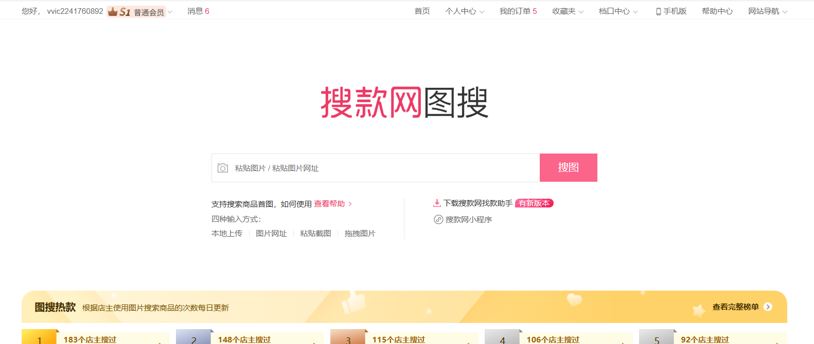
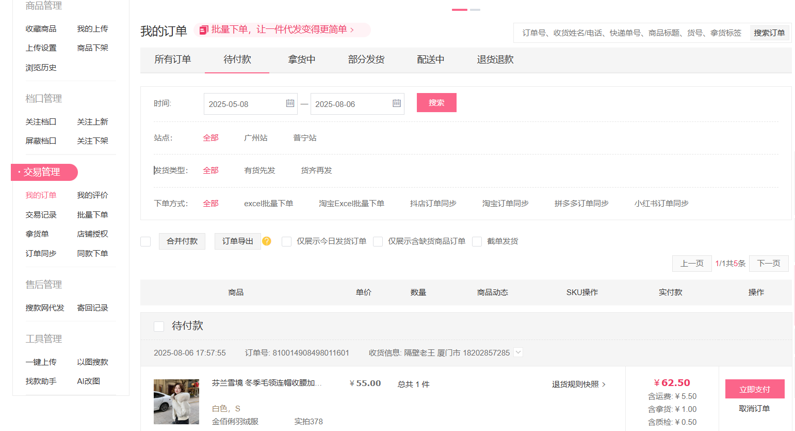

# 页面

### 登录页面
https://www.vvic.com/login.html

### 首页
https://www.vvic.com/user/orders.html?q=&t=0

### 我的订单页面
https://www.vvic.com/user/orders.html?q=&t=0

登录页
https://www.vvic.com/login.html

## 账号密码
账号：18202857285
密码：sange888

# 要求
帮我写一个脚本，模拟浏览器打开网站https://www.vvic.com/login.html，打开登录页面，切换到账号密码登录，输入账号密码，点击登录，
跳转到首页后，读取首页最上面的菜单，模拟点击事件，点击我的订单并进入页面。
到了我的订单页面，点击打开待付款tab

账号密码以及页面地址和截图都在上面，帮我完成这个脚本